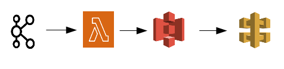

### ETL Exercise
I built two simple [ETL Form](src/etl_form.py) and [ETL Form Events](src/etl_formevents.py) in Python and Pandas DataFrame, where the data source is retrieved from two files [form.json](src/src_data/form.json) and [formevents.json](src/src_data/formevents.json) as I cannot access the API; but in the case you want to test it using the API, it must to uncomment two lines on the extrac_data function and pass the API link instead of the filename. The data is asked to be loaded into an S3 bucket but I don't have access to that either, so it is stored in text format and sqlite tables, moreover the target format can be changed to S3 bucket, for that the out_format parameter in the load_data method has to be modified by "parquet" and pass a valid the bucket address; so the ETL process will load the data into the S3 bucket.


### SQL queries Exercise
To answer the questions, I decided to load the data into Sqlite. please see below the tables DDL.

#### DDL Form table: [form.dll](src/ddl/ddl_form.sql)
```sql
create table form  (
form_id text,
s_language text,
s_progress_bar text,
s_show_time_complete text,
s_no_submision text,
s_redirect_after_submit text,
f_id text,
f_title text,
f_type text,
f_reference text
)
```

#### DDL Event Form table: [form_events.dll](src/ddl/ddl_form_events.sql)
```sql
create table form_events (
form_id text,
form_title text,
form_date timestamp,
form_event_type text
)
```

#### Query  1 
When was a particular form created?

```sql
select fe.form_title , 
       strftime('%d-%m-%Y %H:%M', fe.event_happened_at) as created_time    
from form_events fe 
where fe.form_id = '' -- add form_id
and fe.event_type ='created';
```

#### Query 2 
When was a particular form published?

```sql
select fe.form_title , 
       strftime('%d-%m-%Y %H:%M', fe.event_happened_at) as created_time    
from form_events fe 
where fe.form_id = '' -- add form_id
and fe.event_type ='published';
```

#### Query 3
How many edit events happened, for a particular form, between form creation and form publish

```sql
with chk_events as (
	select distinct form_id  
	from form_events fe 
	where fe.event_type in ('published','created') 
	and fe.form_id='' -- add form_id 
	)
select  count(1) as adited_times
 from chk_events chk join form_events fe  on chk.form_id=fe.form_id 
 where fe.event_type ='edited';
```

#### Query 4
How many fields does a form currently have?

```sql
select form_id ,
count(distinct id) as fields_no
from form f 
group by form_id ;
```

#### Query 5
How many forms currently use language!='en'?

```sql
select form_id ,
count(1) as forms_no
from form f 
where language!='en'
group by form_id ;
```

### Streaming Exercise
Since I don't have a proper environment, I draw the simple architecture of the solutions below. It would use the AWS stack. 



##### AWS Lamda: I would create a Python script to consume the Kafka topic thus retrieving and storing the data.
##### AWS S3: The data would be stored into S3 in Json format
##### AWS API Gateway: It would provide data for the next exercise steps.

### Jobs Scheduled Exercise
Since I have been using Airflow in the last projects, I created a simple [DAG](src/dags/my_dag.py) to carry out the exercise.